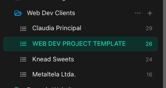
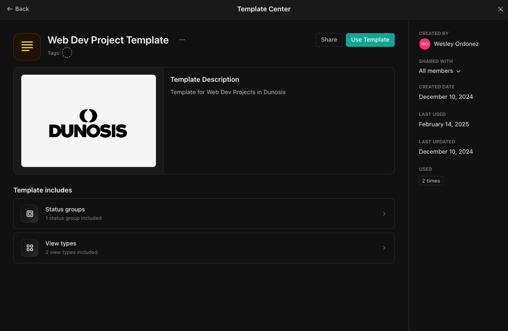

# Web Development Client Onboarding Procedure  

## Overview  
A well-structured onboarding process ensures a smooth start for new web development clients. This process helps define project goals, gather necessary assets, and establish a clear workflow from the beginning.  

The **client onboarding procedure** includes:  
✅ Initial client intake and discovery  
✅ Contract signing and payment setup  
✅ Collecting assets and project requirements  
✅ Setting up project management and communication channels  
✅ Defining deliverables and timeline  

---

## 1️⃣ Initial Client Intake & Discovery  

### 🔍 Discovery Call or Meeting  
The first step in onboarding is to schedule an **introductory call or meeting** to:  
- Discuss the client’s business, goals, and website needs  
- Identify pain points and must-have features  
- Establish the project scope (e.g., new website vs. redesign)  
- Gather any technical preferences (platform, hosting, integrations)  

📌 **Client On-Boarding Questions:** [Client Onboarding Questions](https://example.com/onboarding-questions)  

---

## 2️⃣ Proposal, Contract & Initial Payment  


Once the client intake and discovery process is complete, the next step is formalizing the project agreement. This section ensures the project scope, pricing, and payment terms are clearly defined before work begins.  

---

### 📄 Preparing the Project Proposal  

A well-defined proposal provides clarity on **what will be delivered, when, and at what cost**.  

#### ✅ Steps to Prepare a Proposal  
- **Define project scope and features**  
    - Outline key website functions, integrations, and any additional services.  
- **Use definitions to select or create a pricing plan**  
    - Choose between pre-set pricing tiers or custom quotes.  
- **Define estimated timeline and milestones**  
    - Example:  
        - Wireframes & UI Prototype design: **1-2 weeks**  
        - Development & backend setup: **2-4 weeks**  
        - Testing & revisions: **1-2 weeks**  
- **(Optional) Share examples of past work**  
    - Provide portfolio links or a **generalized demo** if applicable.  

📌 **Proposal Template Available Below**  - (Google Drive)

---

### 📜 Client Agreement & Contract  

Before starting work, ensure the client signs a formal **contract** to prevent misunderstandings and protect both parties.  

#### ✅ Key Terms to Include:  
- **Scope of work** → Define project expectations, deliverables, and exclusions.  
- **Timeline & structure** → Estimated deadlines and milestone approvals.  
- **Payment structure** → Terms for deposits, final payment, and late fees.  
- **Revision policy** → Specify how many revision rounds are included.  
- **Ongoing support** → Define what is covered post-launch (e.g., maintenance, bug fixes).  
- **Legal considerations** → Copyright, intellectual property, liability disclaimers.  
- **E-Signature method** → Use **OpenSign** or another secure e-signature platform.  

📌 **Contract Template Available Below**  

??? info "Contract Template"
    # Website Development Agreement  

    This Website Development Agreement (the "Agreement") is entered into as of **[Date]**, by and between:  

    **Client Name:** [Client Name]  
    **Client Business Name:** [Business Name]  
    **Developer:** Dunosis  

    ## 1. Scope of Work  
    Dunosis agrees to develop a website for the Client as described in the **Project Proposal**.  

    ### 🔹 Deliverables  
    - Fully functional website deployed on [hosting provider]  
    - Admin dashboard access  
    - [Other agreed deliverables]  

    ## 2. Payment Terms  
    The Client agrees to pay the Developer the total project fee of **$[Total Amount]** under the following payment schedule:  
    - **50% deposit ($[Amount])** due upon contract signing.  
    - **50% final payment ($[Amount])** due before final deployment.  

    Failure to complete payment may result in project suspension or termination.  

    ## 3. Revisions & Feedback  
    - The Client is entitled to **[Number] revision rounds**.  
    - Additional revisions beyond this scope will be billed at **$[Hourly Rate]**.  

    ## 4. Intellectual Property & Ownership  
    Upon full payment, the Client will own the rights to the website content and design. The Developer retains the right to showcase the project in their portfolio.  

    ## 5. Maintenance & Support (Optional)  
    After project completion, ongoing support and maintenance can be provided at **$[Monthly Fee]** or per service request.  

    ## 6. Liability & Indemnification  
    The Developer is not responsible for **post-launch website failures** due to third-party changes, security breaches, or content modifications made by the Client.  

    ## 7. Agreement Termination  
    This agreement may be terminated if:  
    - The Client fails to make payment within **[X] days** of the due date.  
    - Either party provides written notice due to unforeseen circumstances.  

    ## 8. Acceptance & Signatures  
    By signing below, both parties agree to the terms of this Agreement.  

    **Client Name:** [Client Signature]  
    **Date:** [Date]  

    **Dunosis Representative:** [Your Signature]  
    **Date:** [Date]  

---

### 💳 Initial Payment  

Once the contract is signed, send the first invoice to secure the project start.  

#### ✅ Payment Process:  
1. **Send the first invoice**  
    - Typically **50% upfront** before development begins.  
2. **Accepted Payment Methods:**  
    - **Stripe** → Secure online credit/debit card payments.  
    - **Zelle** → Direct bank transfer.  
    - **Evalon Payment Terminal** → In-person POS terminal transactions.  
    - **Cash** → Only for local clients (must provide receipt).  


!!! danger "NOTE"
    These steps are CRITICAL. Absolutely ZERO work will be done until a contract is signed and the 50% upfront payment is received. 

---


## 3️⃣ Collecting Assets & Project Requirements  

Before development begins, all required **branding materials, website content, and technical details** must be gathered to ensure a smooth workflow.  

Start by creating a project folder on Google Drive for sharing and archiving, as well as locally for development ease of access. Use this general folder structure as a guide:

```plaintext
📂 [Project_Name]
├── 📁 Archive
├── 📁 Assets
│   ├── 📁 Branding
│   ├── 📁 Client Inspiration
│   ├── 📁 Images
├── 📁 Codebase
├── 📁 Contracts
├── 📁 Design Files
│   ├── 📁 Fonts
│   ├── 📁 Assets
│   ├── 📁 Designs
```

---

### 🎨 Branding & Design Materials  

These assets help maintain **brand consistency** across the website.  

- **Logo files** *(SVG, PNG, AI, or EPS formats preferred)*  
- **Brand colors and typography** *(Hex codes, font files, or brand guidelines)*  
- **Images and videos** *(Product images, team photos, promotional content)*  
- **References & inspiration** *(Example websites, mood boards, or brand inspirations)*  

---

### ✍️ Website Content  

The core content needed for the website, structured for user experience and SEO.  

- **Page structure & sitemap** *(Homepage, About, Services, Blog, Contact, etc.)*  
- **Text/Copy** *(Mission statement, service descriptions, FAQs, etc.)*  
- **Blog articles** *(Pre-written content, article topics, or placeholders)*  
- **Pricing tables** *(Product/service pricing details, comparison tables)*  
- **About bio/info** *(Company history, founder details, team bios)*  
- **Contact information** *(Business phone, email, physical address, social links)*  

---

### 🛠️ Technical Details  

Critical setup details to ensure a smooth **development, deployment, and integration** process.  

- **Domain registrar information** *(Only for domain transfers or DNS changes)*  
- **Third-party integrations** *(CRM, email marketing, payment gateways, social media links, etc.)*  
- **Existing software or tools** *(Booking systems, chat widgets, analytics tools, automation platforms, etc.)*  

---


## 4️⃣ Setting Up Project Management & Communication  

### 📂 Setting Up a New Project in ClickUp  

Using **ClickUp** as the project management system helps keep tasks, deadlines, and deliverables organized.  

#### ✅ Steps to Set Up a New Web Development Project  

1. **Create a New List**  
    - Navigate to the **Web Dev Folder** in ClickUp.  
    - Create a **new list** for the client/project.  

    

2. **Use the Web Dev Project Template**  
    - Apply the **WEB DEV PROJECT TEMPLATE** to maintain consistency.  
    - Ensure task categories (e.g., Design, Development, Testing) are set up correctly.  

    


3. **Complete Project Details**  
    - Add the **project description** based on the proposal.  
    - Assign **due dates** based on the agreed timeline in the quote/contract.  
    - Assign team members to tasks as needed.  

---

### 💬 Communication & Feedback  
✅ **Preferred communication method:** Email, SMS, Google Meets, FaceTime, or WhatsApp?  
✅ **Meeting schedule:** Ideally, milestone based but can be pre-defined cadence (monthly or weekly)  

---


## 5️⃣ Development Kickoff & First Check-In  

Once everything is collected and the project is set up:  

✅ **Send a Project Kickoff Email (Optional)**  
✅ **Confirm first development milestone**  
✅ **Set up hosting environment & dev URL**  
✅ **Schedule the first check-in call with Dev Team**  
