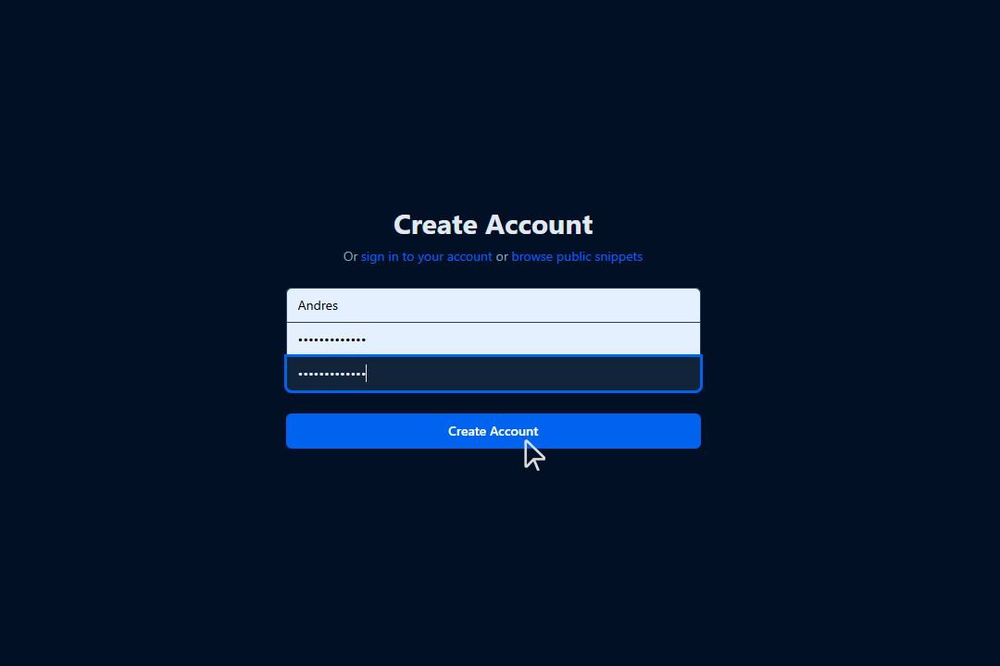
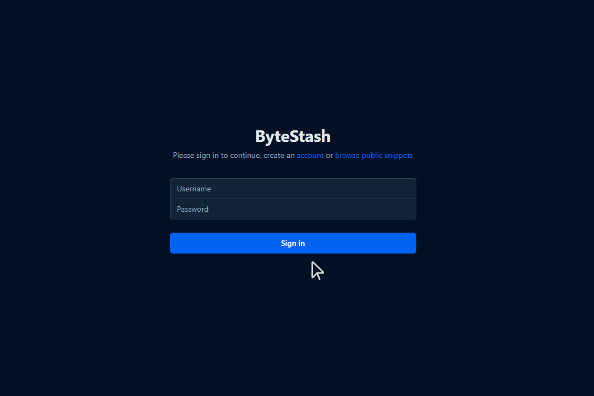
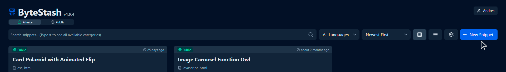
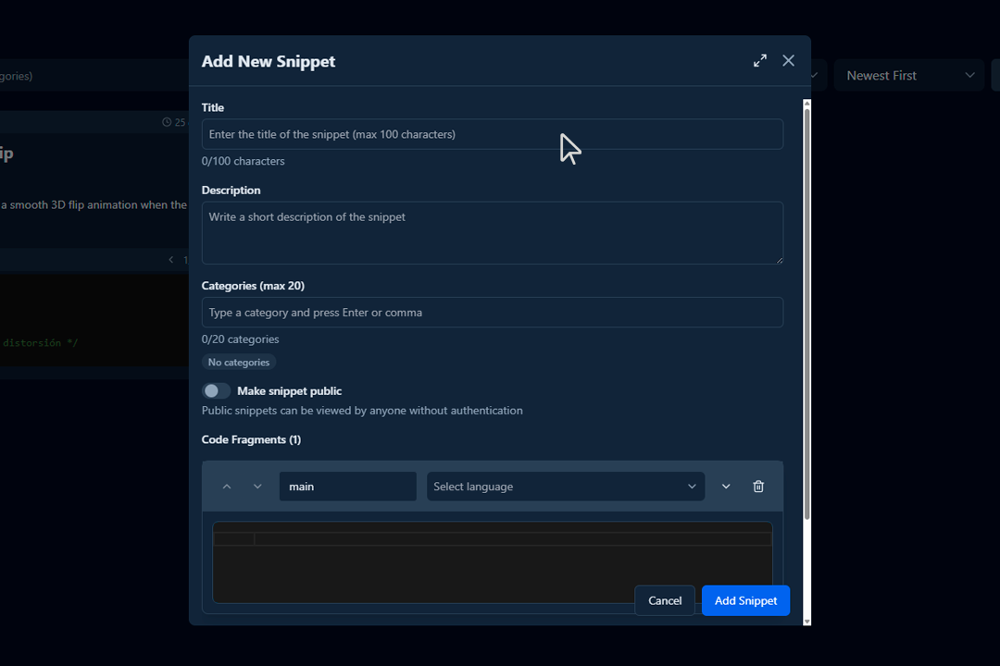
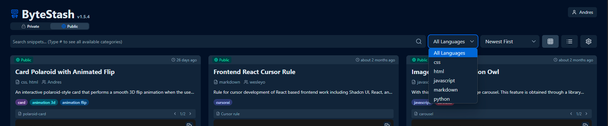
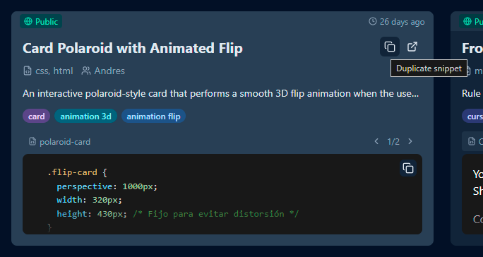

# ByteStash Docs

## 1. Introduction
### What is Bytestash?
Bytestash is an open-source platform where developers can save and share reusable code snippets. Whether you're working in HTML, CSS, JavaScript, Python, Ruby, or many other languages, Bytestash helps you organize your most useful code and keep it accessible. Snippets can be kept private for personal use or made public to share knowledge with the community.

### Purpose of the platform
The main goal of Bytestash is to simplify how developers manage frequently used code. It eliminates the need to search through old projects or scattered notes by centralizing snippets in one accessible location. Additionally, Bytestash fosters collaboration by allowing users to share public snippets with the community, making it easier to reuse trusted, well-documented code.

### Target audience
- **Software developers** looking to organize their code snippets.
- **Development teams** that want to share reusable logic internally.
- **Open source** contributors sharing best practices and utilities.
- **Students and learners** who need a space to store examples or exercises.
- **Frontend/backend engineers** working with various languages or stacks.

### Supported technologies
Bytestash supports syntax highlighting and formatting for a wide range of languages and tools, including:

- **Frontend:** HTML, CSS, JavaScript, TypeScript
- **Backend:** Node.js, Python, PHP, Ruby, Java, C#, Go
- **Markup & Data:** JSON, YAML, XML, Markdown
- **Scripting:** Bash, Shell, PowerShell
- **Databases:** SQL, NoSQL queries
- **Others:** C, C++, Swift, Dart

New languages and formats can be added through contributions or extensions.

---

## 2. Getting Started
### How to register and log in

You can <a href="https://code.dunosis.com/register" target="_blank" rel="noopener noreferrer">register</a> by entering a username and password.

{ loading=lazy }

If you already have an account, log in to the platform  <a href="https://code.dunosis.com/login" target="_blank" rel="noopener noreferrer">here</a>.

{ loading=lazy }

### Creating your first snippet
{ loading=lazy }

### 🧾 How to Fill Out the “Add New Snippet” Form
{ loading=lazy }

When creating a new snippet in Bytestash, you’ll be asked to fill out several fields. Here’s a step-by-step guide:

---

1. **Title**

    - **Required**
    - Enter a **clear and descriptive title** for your snippet.
    - This helps others (and yourself) quickly understand what the code does.

    ???+ success "Examples"

        **"Fetch Data with Axios in React"**

        **"Dynamic Pricing Card"**  for a frontend based snippet

        **"Django Configurations"** for a admin snippet

---

2. **Description** 📝

    - **Required**
        - **Repository Reference (Required):** Include a direct link to the GitHub repository (or specific file/line) where the snippet is used.
        - **Context or Use Case:** Describe when and why this snippet should be used.
        - **Project/Module Name (Optional, Recommended):** Identify the module or feature this code belongs to within the repo (for teams with multiple modules).
        - **Snippet Versioning or Last Updated:** Indicate when the snippet was last reviewed or modified.
        - **Expected Output / Behavior:** Briefly explain what this snippet is expected to return or do.
        - **Dependencies:** Mention any libraries, environment, or tools required for the snippet to work.

    ???+ success "Examples"

        - This snippet handles login form validation in React.
        - See usage in: [GitHub Repo](https://github.com/your-org/your-app/blob/main/src/components/LoginForm.jsx)
        
        - Output: Returns an array of filtered user objects matching the search criteria.

        - Requires: Axios, React 18+, useEffect, useState 
        - ⚠️ Does not handle network errors or 401 responses — must be handled separately.

        - See also: [Custom Axios Hook Snippet](https://code.bytestash.com/snippets/custom-axios-hook)
---

3. **Categories (max 20)**

    - Add keywords or tags to help organize and search snippets.
    - Press **Enter** or **comma** after each category.
    - Categories help others find your snippet based on functionality or technology.

    ???+ success "Examples"

        `axios`, `react`, `api`, `frontend`
---

4. **Visibility – Make Snippet Public** 🌍 

    - Toggle **on** to make your snippet accessible to anyone.
    - If left **off**, the snippet will be private and only visible to you.
---

5. **Code Fragments** 💻

    - Add the actual code here.
    - You can select the **language** from the dropdown to enable syntax highlighting.
    - You may add **as many code fragments as needed**, for example: HTML + CSS + JS in the same snippet.

    **To add more fragments:**

    - Click the `+` button next to “Code Fragments”.

        ???+ success "Examples"

            * Fragment 1: `main` → `JavaScript`
            * Fragment 2: `style` → `CSS`
---

6. **Final Step – Save** 

Click the blue **“Add Snippet”** button to save your code snippet to your library.

## 3. Using the Platform
### Searching and filtering snippets
- You can search for your snippets using the search bar.
- Additionally, use the available filters to narrow down results by programming language or other categories.

{ loading=lazy }

### Don't rewrite a snippet, just duplicate it.
- If you want to create a snippet based on another,
- if you don't want to rewrite the same code twice, just duplicate it.

{ loading=lazy }

### Quick code copying
- Click on the card with the snippet.
- copy the code you require from your chosen snippet.
    
### How to tag and categorize snippets

Properly tagging your snippets helps improve searchability, organization, and reusability. Here’s a list of characteristics to consider when assigning tags to a snippet:

---

###  🏷️ Characteristics for Effective Snippet Tagging

1. **Programming Language**   
    - Examples: `javascript`, `python`, `html`, `css`, `sql`

2. **Functionality Type**   
    - Examples: `auth`, `validation`, `api-call`, `form-handling`, `date-format`, `file-upload`

3. **Framework or Environment**   
    - Examples: `react`, `vue`, `express`, `django`, `flask`, `nodejs`, `laravel`

4. **Abstraction Level**   
    - Examples: `helper`, `component`, `middleware`, `hook`, `service`, `directive`

5. **Usage Context**   
    - Examples: `frontend`, `backend`, `database`, `cli`, `mobile`, `testing`

6. **Operation Type**   
    - Examples: `get-request`, `post-request`, `loop`, `conditional`, `render`, `fetch`, `sort`

7. **Complexity or Size**   
    - Examples: `basic`, `intermediate`, `advanced`, `one-liner`, `utility`

8. **Technology or Compatibility**   
    - Examples: `typescript`, `es6`, `sass`, `jquery`, `bootstrap`, `tailwind`, `rest`, `graphql`

9. **Problem/Task Keywords**   
    - Examples: `token-expiration`, `image-resize`, `csv-export`, `debounce`, `infinite-scroll`

10. **Purpose or General Category**
    - Examples: `performance`, `security`, `accessibility`, `ux`, `refactor`, `debugging`

---

### ✅ Best Practices for Tagging

- Use **lowercase** and **no spaces** (`image-upload`, not `Image Upload`)
- Limit to **4–7 tags per snippet** when possible
- Be **specific but meaningful** — use `auth` instead of `misc`
- Use **consistent terminology** across your team or workspace

---
## 4. Supported Languages and Formats
### 🔹 List of Supported Languages

Bytestash supports a wide variety of programming and scripting languages to accommodate different use cases. These include:

- **Frontend**: HTML, CSS, JavaScript, TypeScript
- **Backend**: Python, Ruby, PHP, Java, C#, Node.js
- **Scripting**: Bash, Shell, PowerShell
- **Database**: SQL, MongoDB, GraphQL
- **Mobile & Desktop**: Swift, Kotlin, Dart, C++
- **Others**: YAML, JSON, Markdown, XML, SCSS, JSX, TSX

Additional languages may be added progressively or via community contributions.

---

### 🔹 Syntax Highlighting Support

Bytestash uses language-aware syntax highlighting to make code easier to read and understand. Each code fragment can be assigned a language, and the editor automatically applies appropriate styling and colorization.

- Highlighting is powered by a built-in highlighter (e.g., Prism.js or Highlight.js).
- Multi-language snippets are supported by allowing multiple fragments per snippet.
- Unknown or unsupported languages will fall back to plain text.

---

### 🔹 Best Practices for Uploading Snippets

To ensure your snippets are easy to understand, reusable, and searchable, follow these best practices:

1. **Use a descriptive title** that clearly explains what the snippet does.
2. **Write a concise description** with the purpose or context of the snippet.
3. **Tag your snippet** with relevant categories (e.g., `api`, `auth`, `loop`).
4. **Format your code properly** with indentation and meaningful variable names.
5. **Avoid unnecessary code**, comments, or sensitive information (e.g., API keys).
6. **Group related code fragments** together (e.g., HTML + CSS + JS for a component).
7. **Use consistent language selection** for syntax highlighting.
---

**Author:** Andrés Ribera E.
**Last updated:** July 25, 2025
<!-- 
## 5. Privacy and Security
### Visibility control: public vs private

### How to protect your code snippets

### User roles and permissions (if applicable)

## 6. Collaboration and Community
### Contributing public snippets
    
### Guidelines for community snippets
    
### Content moderation rules
    
### Comments or rating system (if available)
    
## 7. Developer Section (if the platform is extensible)
### Public API (if available)
    
### Integrating ByteStash into your workflow (CLI, VS Code, etc.)
    
### Webhooks and automation
    
### Auto-importing snippets from other platforms
    
## 8. FAQ (Frequently Asked Questions)
### Can I edit a public snippet?
    
### What happens if I delete a snippet?
    
### Are there any size or language limits?
    
## 9. Support and Contact
### How to get support (email, Discord, etc.)
    
### Reporting bugs or security issues
    
### Suggesting new features
    
##10. Credits and License
### Open source license
    
### Development team credits
    
### Contributor acknowledgments -->