# Deploying a Next.js Application on DigitalOcean Droplets

This document provides a step-by-step guide for deploying a Next.js application on a DigitalOcean Droplet using Node.js, PM2, Nginx, PostgreSQL, and Certbot.
By the end of this guide, you will have a production-ready Next.js app running with HTTPS and automatic deployment via GitHub Actions.


## Prerequisites

- A DigitalOcean Droplet running Ubuntu 22.04 LTS (or newer).
- A GitHub/GitLab repository containing your Next.js application.
- SSH access to the Droplet.
- A registered domain (e.g., from Porkbun, Namecheap, Cloudflare, etc.).

## Part 1: Provisioning a DigitalOcean Droplet
### 1. Create a Droplet

From the DigitalOcean Dashboard:

 - Go to Create > Droplets.
 - Select Ubuntu 22.04 LTS as the base image.
 - Choose CPU, memory, and disk resources according to your workload.
 - Configure SSH keys (recommended) or a root password.
 - Click Create Droplet.

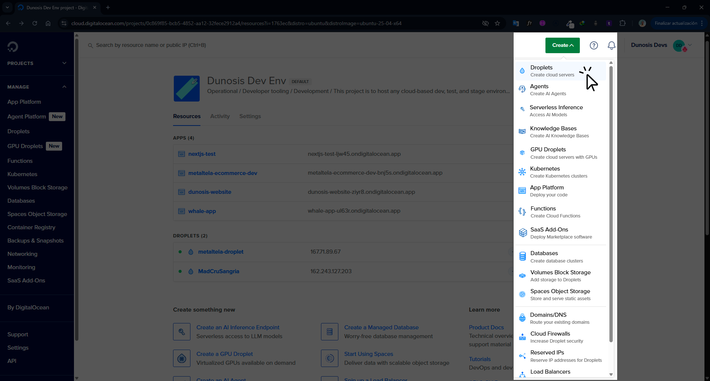
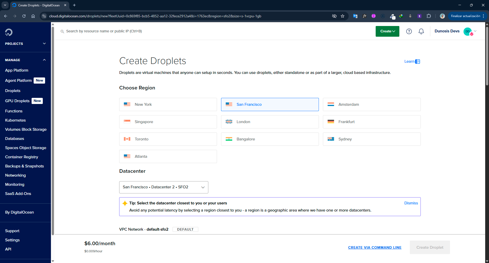
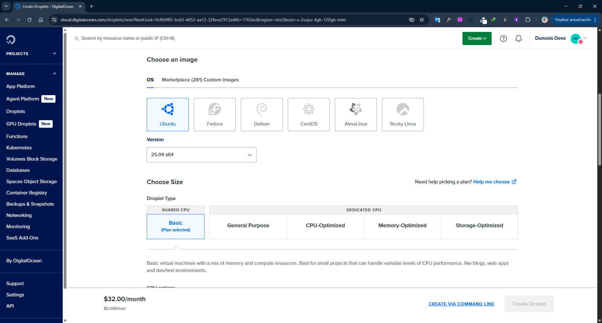
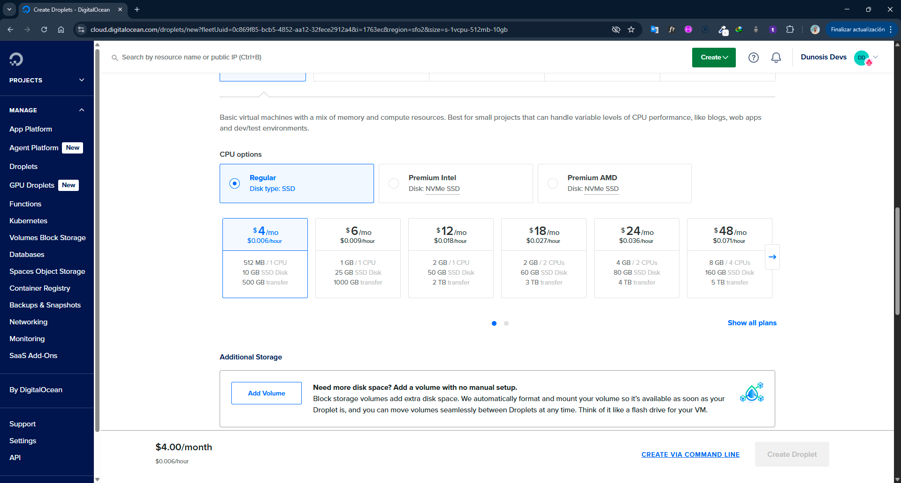

You finish configuring more details that you want your VPS server to have.
Once you have configured all the features you want this droplet to have, click on create droplets.
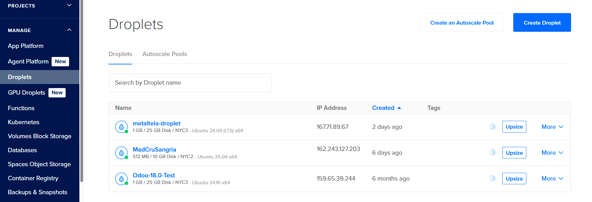
Excellent!! You just created your first Droplets!

### 2. Initial Server Configuration

we access through ssh
```bash
ssh root@<SERVER_IP>
```

Update package:
```bash
sudo apt update && sudo apt upgrade -y
```

Create a non-root user with sudo privileges:
```bash
adduser <username>
usermod -aG sudo <username>
```

Login with the new user:
```bash
su - <username>
```
!!! note
    Always use non-root users for application deployments.

## Part 2: Create a Workflow
Once our project is uploaded, we go to Git Actions and we'll see these workflow suggestions. We choose the node one.

### 1. Create Workflow File
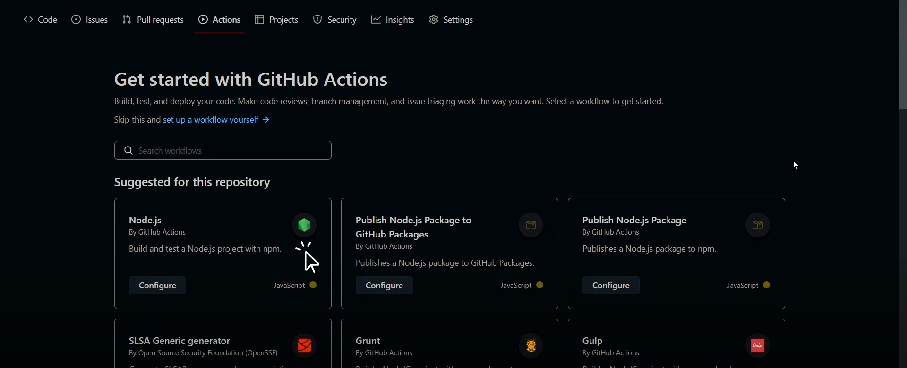
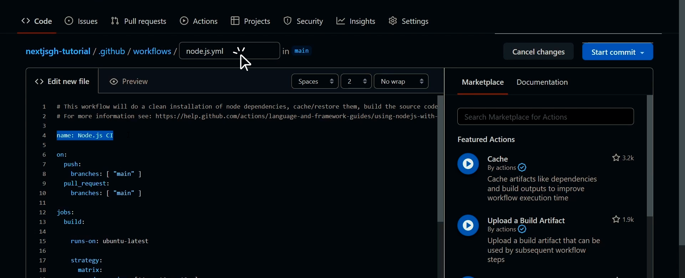
We configure this file as follows.

``` yaml
name: Node.js CI

on:
  push:
    branches: [ "main" ]

jobs:
  build:

    runs-on: self-hosted #It means that everything will be done within the server

    strategy:
      matrix:
        node-version: [22.x] #depending on the versions we have installed

    steps:
    - uses: actions/checkout@v4
    - name: Use Node.js ${{ matrix.node-version }}
      uses: actions/setup-node@v4
      with:
        node-version: ${{ matrix.node-version }}
        cache: 'npm'
    - run: npm ci --no-audit --no-fund
    - run: npm run build --if-present
    - run: pm2 reload 0
```
Once the previous modifications are completed, we click on start commit.
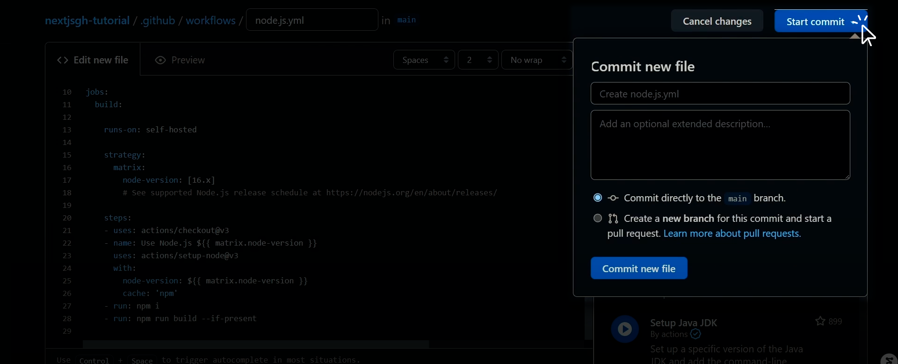
!!! note
    This adds a new file and directory to our repository. We'll then need to git pull these changes in our local project.

### 2. Create Runner
You go to settings > actions > runner
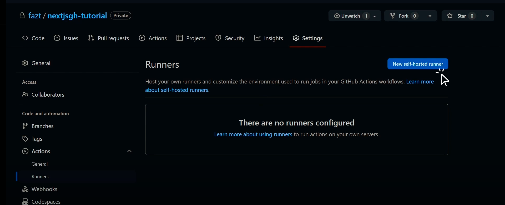
We select the new self-hosted runner button

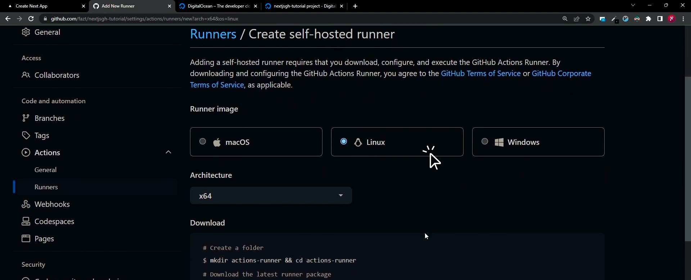
We select the operating system of our server and its architecture.

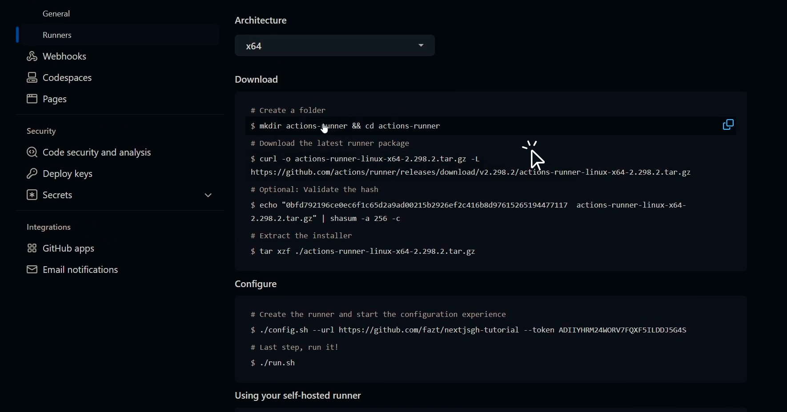
then we have to copy and paste these commands into our server.

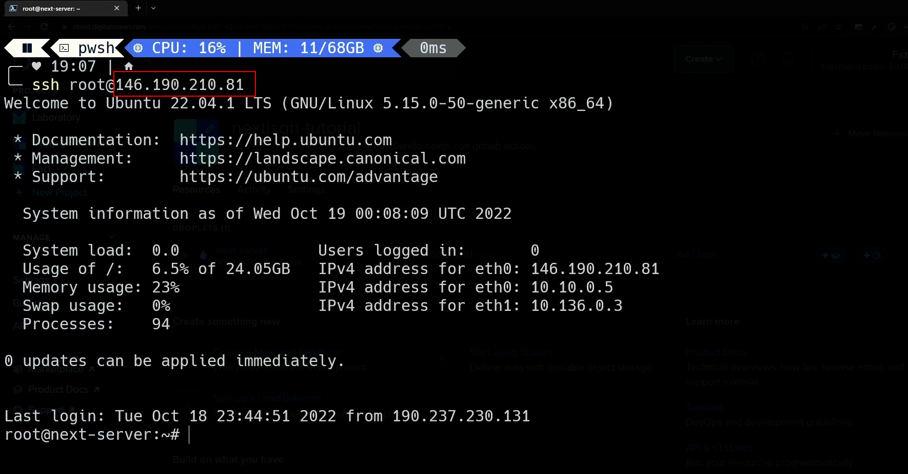
We enter our terminal through the SSH port that Digital Ocean gave us.

We log in with our user that we made administrator
```bash
ssh root@146.190.210.81
su - [name]
```
Then enter the commands that Runner gave us to configure our server and have it listen to our changes.

## Part 3. Configure PM2
This service allows our application to always run in the background.

### 1. Install NVM
Before that we must install [nvm](https://github.com/nvm-sh/nvm?tab=readme-ov-file#install--update-script)
``` powershell
curl -o- https://raw.githubusercontent.com/nvm-sh/nvm/v0.40.3/install.sh | bash
```
!!! note
    If we run `# nvm` in our console it does not mean that it has not been installed but that we have to close the section and re-enter. 

If we do not want to do this then we run the following command from our powershell.
``` powershell
source ~/.bashrc
```

We can check that our `nvm` is now running.
``` powershell
nvm
```

Now we install the most updated version of NVM stable.
``` powershell
nvm install --lts
```

We can check that we have node and npm installed
``` powershell
node --version
npm --version
```

### 2. Install PM2
``` powershell
npm install -g pm2
```
We check that we have PM2 installed
 ``` powershell
pm2 --version
```
we locate ourselves in our archive where our project is.
``` powershell
cd /actions-runner/[project]/[project]/[project-github]
pm2 start npm -- start
```

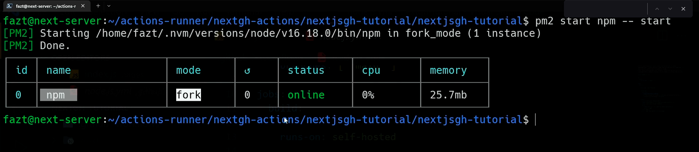
If we go to our browser, we can see that our website is already running. We'll have to add the corresponding port for now.
`146.190.210:3000` 


## Part 4. Execute svc.
This allows our server to listen for any changes to our main branch.
``` powershell
sudo ./svc.sh status
sudo ./svc.sh install
sudo ./svc.sh start
```
We can check that it is running on GitHub.
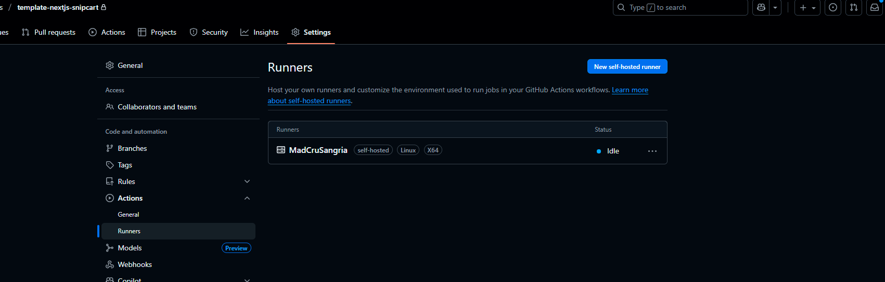
To stop this service we use
``` powershell
sudo ./svc.sh stop
```
If there is an error with pm2 and github actions the solution is [here](https://stackoverflow.com/questions/69644460/github-actions-pm2-command-not-found)
which basically is to copy the following codes:
``` powershell
sudo ln -s "$NVM_DIR/versions/node/$(nvm version)/bin/node" "/usr/local/bin/node"

sudo ln -s "$NVM_DIR/versions/node/$(nvm version)/bin/npm" "/usr/local/bin/npm"

sudo ln -s "$NVM_DIR/versions/node/$(nvm version)/bin/pm2" "/usr/local/bin/pm2"
```

## Part 5. Install and configure nginx + SSL
Since you'll need HTTPS, nginx is actually the easiest way to handle SSL certificates:
``` powershell
sudo apt install nginx certbot python3-certbot-nginx -y
```

To check that nginx is running:
``` powershell
sudo service nginx status
```

If it's active, we can verify that it's running on our server's IP address without adding the :3000.
Now, to configure our website on this port, we enter the following address.
``` powershell
cd /etc/nginx/sites-available/
```

If we run `ls` we'll see a default configuration file called default.
We can modify this to view our site directly, but it's good practice to create a new one.
To do this, we'll use the `nano` command and assign it a name.
## Create nginx config for your site
``` powershell
sudo nano /etc/nginx/sites-available/your-domain.com
```

Add this config (replace your-domain.com):
``` yaml
server {
    listen 80;
    server_name your-domain.com www.your-domain.com;

    location / {
        proxy_pass http://localhost:3000;
        proxy_http_version 1.1;
        proxy_set_header Upgrade $http_upgrade;
        proxy_set_header Host $host;
        proxy_cache_bypass $http_upgrade;
    }
}
```

bash# Enable the site
``` powershell
sudo ln -s /etc/nginx/sites-available/your-domain.com /etc/nginx/sites-enabled/
sudo nginx -t
sudo systemctl reload nginx
```

## Get SSL certificate
``` powershell
sudo certbot --nginx -d your-domain.com -d www.your-domain.com
```

**Author:** Andrés Ribera E.
**Last updated:** August 24, 2025