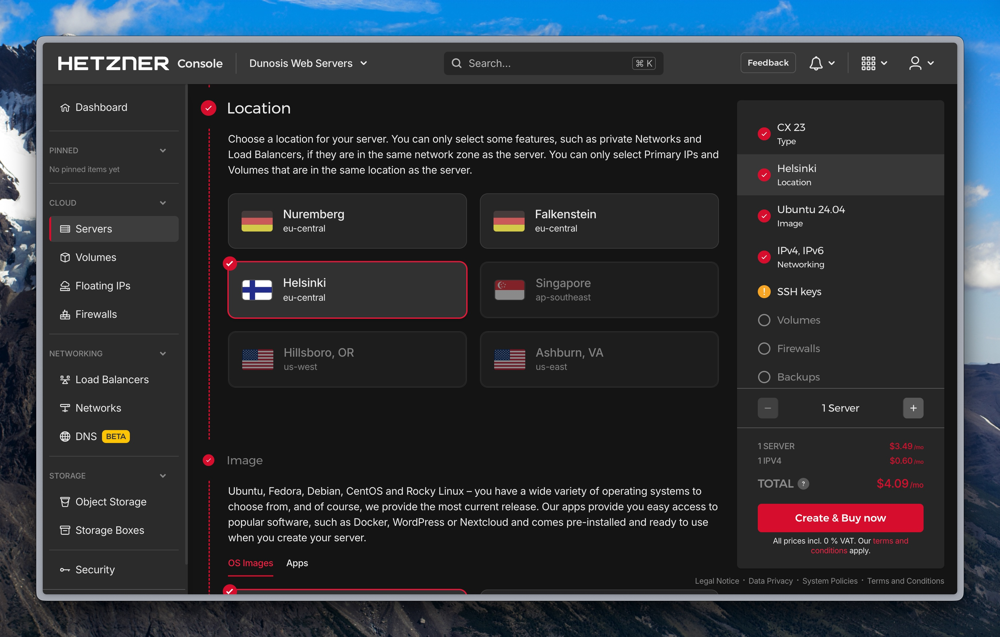

# Deployment Process: Hetzner + Coolify

This guide documents the complete process for provisioning a Virtual Private Server (VPS) on **Hetzner** and configuring it with **Coolify** for automated application deployment.

## Part 1: Provisioning the Server (Hetzner)

### 1. Create the Server

Everything starts with a VPS on [Hetzner Cloud](https://www.hetzner.com/cloud).
In your control panel, select your project and click **Add server**.

{ loading=lazy }

### 2. Configure the Server

Next, you will need to configure the server specifications based on your needs.

{ loading=lazy }

#### Location

The location is not critical if you choose the cheapest option. If you need a specific location (e.g., to reduce latency for users in the US), select **Ashburn, VA**.

{ loading=lazy }

#### Image

Select **Ubuntu 24.04**.

!!! note
    Coolify v4 officially recommends **Ubuntu 22.04 LTS** or **Ubuntu 24.04 LTS** (64-bit) for optimal performance and compatibility. You can change this later, but it's best to start with the recommended image.

{ loading=lazy }

#### Server Type

For most development projects or small applications, the cheapest option (like `CAX11`) is usually sufficient.

!!! tip "Tip: Resource Planning"
    While the cheapest option is a good starting point, consider your needs.
    _ **ARM (CAX):** Best price-to-performance ratio, ideal for most web applications.
    _ **x86 (CPX):** Necessary if you rely on Docker images that only have an `amd64` build.

{ loading=lazy }

#### SSH Keys

This is a crucial security step!

- **Recommended:** Select the SSH keys you will use to access the server. You must have the key pair (public and private) already generated on your local machine.
- **Not Recommended:** If you do not select any key, Hetzner will email you the `root` password.

!!! warning "Security First!"
    **Never use the `root` password for Coolify.** It's a bad security practice. Always use SSH keys. If you receive the password via email, use it only for the first login to set up SSH key access, then disable password login.

{ loading=lazy }
{ loading=lazy }

#### Additional Options

For a standard Coolify setup, you can leave the defaults.

- **Networking:** Leave as default.
- **Volumes:** Useful if you need more disk space without increasing CPU/RAM.
- **Firewalls:** You can configure this later. Coolify will manage the necessary ports via `ufw` on the server itself.
- **Backups:** Highly recommended for production! It's a low additional cost for daily copies.
- **Labels:** Useful for organizing many servers.
- **Cloud Config:** For first-boot scripts (advanced users).

#### Server Name

Assign a descriptive name to the server.

!!! tip "Naming Convention"
    A good convention helps with organization:
    _ Use the project or client name in lowercase.
    _ Use dashes (`-`) instead of spaces.
    _ Avoid numbers or special symbols.
    _ Add a descriptor if necessary (e.g., `prod`, `staging`). \* _Example:_ `duosis-website-prod` \* _Example:_ `saras-cocina-migration`

Finally, click **Create & Buy now**. Your server will take a few seconds to provision.

{ loading=lazy }

---

## Part 2: Connect Server to Coolify

### 3. Add Server to Coolify

Once the server is active in Hetzner (and you have its IP address), go to your Coolify instance:

1.  Navigate to **Servers** and click **Add a new Server**.
2.  Fill in the fields:
    - **Name:** Use the same name as in Hetzner for consistency.
    - **Description:** Add a simple description (e.g., "Duosis production server").
    - **IP Address:** The public IP address of your Hetzner server.
    - **User:** `root` (if you will use the `root` SSH key you selected).
    - **Port:** `22` (default).
    - **Private Key:** Select the private SSH key that _corresponds_ to the public key you added to the server in Hetzner.

{ loading=lazy }
{ loading=lazy }

### 4. Validate and Install Docker

Click **Save & Connect**. Coolify will attempt to connect to the server using the provided SSH key.

- If the connection is successful, Coolify will check if Docker is installed.
- If it's the first time, Coolify will automatically install and configure **Docker Engine** and **Docker Compose** on the server.

{ loading=lazy }

And that's it! Your server is provisioned and connected, ready to deploy applications.

---

## Part 3: Deploy an Application

### 5. Create a Project in Coolify

Projects are used to group related resources (applications, databases, etc.).

1.  In Coolify, go to **Projects**.
2.  Click **Add a new Project**.
3.  Assign a name (e.g., the client's or website's name) and a description.

{ loading=lazy }
{ loading=lazy }

### 6. Create Environments

By default, a project is created with an environment named `production`. It's good practice to create a development environment (`development` or `dev`).

1.  Inside your project, click **Add a new Environment**.
2.  Name it `development`.

!!! tip "Environment Parity"
    You can create more environments as needed (e.g., `staging`, `testing`). This allows you to test changes in one environment (like `development`) before promoting them to `production`.

{ loading=lazy }

### 7. Create Resources (Application)

We will create a resource (your application) within the `development` environment.

1.  Select the `development` environment.
2.  Click **Add a new Resource**.
3.  You have several options. The most common is to deploy from a **GitHub**, **GitLab**, or **Bitbucket** repository.
4.  Select **Based on a Git repository**.

{ loading=lazy }
{ loading=lazy }
{ loading=lazy }

Next, configure the repository source:

- **Server:** Select the Hetzner server you configured earlier.
- **Git App:** Choose the GitHub App you have connected to your Coolify instance.

!!! note "Prerequisite: GitHub App"
    This step assumes you have already configured a "Source" in Coolify by linking your GitHub account via the [Coolify GitHub App](https://coolify.io/docs/sources/github).

{ loading=lazy }
{ loading=lazy }

- **Repository:** Select your project's repository.
- **Branch:** For the `development` environment, select your development branch (e.g., `dev` or `develop`). For `production`, you would use `main` or `master`.

{ loading=lazy }

- **Build Pack:** Change this to **Docker Compose**. This tells Coolify to look for a `docker-compose.yml` file in your repository.
- **Docker Compose File:** Specify the path to your compose file (e.g., `./docker-compose.yml`).

!!! warning "File Extension"
    Make sure the file extension is correct. Coolify differentiates between `.yml` and `.yaml`.

{ loading=lazy }

### 8. Configure the Application

Once the resource is created, click on it to access its configuration.

{ loading=lazy }

- **General:**
  - **Name:** Name your application. Follow a convention: `<app-name>-dev` for development and `<app-name>-prod` for production.
  - **Description:** Add a description.
- **Domains:**
  - If you don't have a domain, Coolify can generate a preview URL (e.g., `app-name.your-coolify-server.com`).
  - If you have a domain, add it here. For development, you can use a subdomain like `dev.my-domain.com`. For production, you would use `my-domain.com` and `www.my-domain.com`.
  - (The step of configuring DNS to point to your server's IP is documented separately).
- **Build:**
  - Here you can add custom `build` or `start` commands if your `docker-compose.yml` requires them or if you are not using Compose.
- **Environment Variables:**
  - Add any environment variables (secrets, API keys, etc.) your application needs.
  - **Merge pull request variables?** Enable this if you want environment variables to be injected into Pull Request previews as well.

!!! tip "Developer View"
    Use the **Developer View** to add or edit environment variables in bulk (in `.env` format), which is much faster.

### 9. Deploy and Test!

Once all the configuration is in place:

1.  Click the **Deploy** button.
2.  Coolify will fetch the code from your branch, build the Docker image (if necessary), and start the services defined in your `docker-compose.yml`.
3.  You can watch the real-time progress in the **Deployment Logs** tab.

If everything is configured correctly (especially your `Dockerfile` and `docker-compose.yml`), the deployment should succeed. If it fails, the logs will indicate the error, which is usually a configuration issue or a missing environment variable.

---

**Author:** Wesley Ordonez 
**Last updated:** April 14, 2025

---

# Documentación en Español

# Proceso de Despliegue: Hetzner + Coolify

Esta guía documenta el proceso completo para provisionar un servidor virtual (VPS) en **Hetzner** y configurarlo con **Coolify** para el despliegue automatizado de aplicaciones.

## Parte 1: Provisionar el Servidor (Hetzner)

### 1. Creación del Servidor

Todo comienza con un VPS en [Hetzner Cloud](https://www.hetzner.com/cloud).
En tu panel de control, selecciona tu proyecto y haz clic en **Add server** (Añadir servidor).

{ loading=lazy }

### 2. Configuración del Servidor

A continuación, deberás configurar las especificaciones del servidor según tus necesidades.

{ loading=lazy }

#### Ubicación (Location)

La ubicación no es crítica si eliges la opción más económica. Si necesitas una ubicación específica (p. ej., para reducir latencia con usuarios en EE.UU.), selecciona **Ashburn, VA**.

{ loading=lazy }

#### Imagen (Image)

Selecciona **Ubuntu 24.04**.

!!! note "Nota"
    Coolify v4 recomienda oficialmente **Ubuntu 22.04 LTS** o **Ubuntu 24.04 LTS** (64-bit) para un rendimiento y compatibilidad óptimos. Puedes cambiar esto más tarde, pero es mejor empezar con la imagen recomendada.

{ loading=lazy }

#### Tipo de Servidor (Type)

Para la mayoría de los proyectos de desarrollo o aplicaciones pequeñas, la opción más económica (como `CAX11`) suele ser suficiente.

!!! tip "Tip: Planificación de Recursos"
    Aunque la opción más barata es un buen punto de partida, considera tus necesidades.
    _ **ARM (CAX):** Mejor relación precio/rendimiento, ideal para la mayoría de las aplicaciones web.
    _ **x86 (CPX):** Necesario si dependes de imágenes Docker que solo tienen compilación `amd64`.

{ loading=lazy }

#### Claves SSH (SSH Keys)

¡Este es un paso de seguridad crucial!

- **Recomendado:** Selecciona las claves SSH que usarás para acceder al servidor. Debes tener el par de claves (pública y privada) generado previamente en tu máquina local.
- **No recomendado:** Si no seleccionas ninguna clave, Hetzner te enviará un correo electrónico con la contraseña de `root`.

!!! warning "¡Seguridad Primero!"
    **Nunca uses la contraseña de `root` para Coolify.** Es una mala práctica de seguridad. Siempre usa claves SSH. Si recibes la contraseña por correo, úsala solo la primera vez para iniciar sesión y configurar el acceso con tu clave SSH, luego deshabilita el inicio de sesión con contraseña.

{ loading=lazy }
{ loading=lazy }

#### Opciones Adicionales

Para una configuración estándar de Coolify, puedes dejar los valores predeterminados.

- **Networking:** Dejar por defecto.
- **Volumes:** Útil si necesitas más espacio en disco sin aumentar la CPU/RAM.
- **Firewalls:** Puedes configurar esto más tarde. Coolify gestionará los puertos necesarios a través de `ufw` en el propio servidor.
- **Backups:** ¡Altamente recomendado para producción! Es un costo adicional bajo por copias diarias.
- **Labels:** Útil para organizar muchos servidores.
- **Cloud Config:** Para scripts de primer arranque (usuarios avanzados).

#### Nombre del Servidor

Asigna un nombre descriptivo al servidor.

!!! tip "Convención de Nombres"
    Una buena convención ayuda a la organización:
    _ Usa el nombre del proyecto o cliente en minúsculas.
    _ Usa guiones (`-`) en lugar de espacios.
    _ Evita números o símbolos especiales.
    _ Añade un descriptor si es necesario (p. ej., `prod`, `staging`). \* _Ejemplo:_ `duosis-website-prod` \* _Ejemplo:_ `saras-cocina-migration`

Finalmente, haz clic en **Create & Buy now**. Tu servidor tardará unos segundos en provisionarse.

{ loading=lazy }

---

## Parte 2: Conectar Servidor a Coolify

### 3. Añadir Servidor a Coolify

Una vez que el servidor esté activo en Hetzner (y tengas su dirección IP), ve a tu instancia de Coolify:

1.  Navega a **Servers** y haz clic en **Add a new Server**.
2.  Completa los campos:
    - **Name:** Usa el mismo nombre que en Hetzner para mantener la coherencia.
    - **Description:** Añade una descripción simple (p. ej., "Servidor de producción Duosis").
    - **IP Address:** La dirección IP pública de tu servidor Hetzner.
    - **User:** `root` (si usarás la clave SSH de `root` que seleccionaste).
    - **Port:** `22` (predeterminado).
    - **Private Key:** Selecciona la clave SSH privada que _corresponde_ a la clave pública que añadiste al servidor en Hetzner.

{ loading=lazy }
{ loading=lazy }

### 4. Validar e Instalar Docker

Haz clic en **Save & Connect**. Coolify intentará conectarse al servidor usando la clave SSH proporcionada.

- Si la conexión es exitosa, Coolify comprobará si Docker está instalado.
- Si es la primera vez, Coolify instalará y configurará automáticamente **Docker Engine** y **Docker Compose** en el servidor.

{ loading=lazy }

¡Y eso es todo! Tu servidor está provisionado y conectado, listo para desplegar aplicaciones.

---

## Parte 3: Desplegar una Aplicación

### 5. Crear un Proyecto en Coolify

Los proyectos se utilizan para agrupar recursos relacionados (aplicaciones, bases de datos, etc.).

1.  En Coolify, ve a **Projects**.
2.  Haz clic en **Add a new Project**.
3.  Asigna un nombre (p. ej., el nombre del cliente o del sitio web) y una descripción.

{ loading=lazy }
{ loading=lazy }

### 6. Crear Entornos

Por defecto, un proyecto se crea con un entorno llamado `production`. Es una buena práctica crear un entorno de desarrollo (`development` o `dev`).

1.  Dentro de tu proyecto, haz clic en **Add a new Environment**.
2.  Nómbralo `development`.

!!! tip "Paridad de Entornos"
    Puedes crear más entornos según sea necesario (p. ej., `staging`, `testing`). Esto te permite probar cambios en un entorno (como `development`) antes de promocionarlos a `production`.

{ loading=lazy }

### 7. Crear Recursos (Aplicación)

Crearemos un recurso (tu aplicación) dentro del entorno `development`.

1.  Selecciona el entorno `development`.
2.  Haz clic en **Add a new Resource**.
3.  Tienes varias opciones. La más común es desplegar desde un repositorio de **GitHub**, **GitLab** o **Bitbucket**.
4.  Selecciona **Based on a Git repository**.

{ loading=lazy }
{ loading=lazy }
{ loading=lazy }

A continuación, configura la fuente del repositorio:

- **Server:** Selecciona el servidor de Hetzner que configuraste anteriormente.
- **Git App:** Elige la GitHub App que has conectado a tu instancia de Coolify.

!!! note "Prerrequisito: GitHub App"
    Este paso asume que ya has configurado una "Source" (Fuente) en Coolify, vinculando tu cuenta de GitHub a través de la [GitHub App de Coolify](https://coolify.io/docs/sources/github).

{ loading=lazy }
{ loading=lazy }

- **Repository:** Selecciona el repositorio de tu proyecto.
- **Branch:** Para el entorno `development`, selecciona tu rama de desarrollo (p. ej., `dev` o `develop`). Para `production`, usarías `main` o `master`.

{ loading=lazy }

- **Build Pack:** Cambia esto a **Docker Compose**. Esto le dice a Coolify que busque un archivo `docker-compose.yml` en tu repositorio.
- **Docker Compose File:** Especifica la ruta a tu archivo de composición. (p. ej., `./docker-compose.yml`).

!!! warning "Extensión de archivo"
    Asegúrate de que la extensión del archivo sea la correcta. Coolify diferencia entre `.yml` y `.yaml`.

{ loading=lazy }

### 8. Configurar la Aplicación

Una vez creado el recurso, haz clic en él para acceder a su configuración.

{ loading=lazy }

- **General:**
  - **Name:** Nombra tu aplicación. Sigue una convención: `<app-name>-dev` para desarrollo y `<app-name>-prod` para producción.
  - **Description:** Añade una descripción.
- **Domains:**
  - Si no tienes un dominio, Coolify puede generar una URL de vista previa (p. ej., `app-name.tu-coolify-server.com`).
  - Si tienes un dominio, añádelo aquí. Para desarrollo, puedes usar un subdominio como `dev.mi-dominio.com`. Para producción, usarías `mi-dominio.com` y `www.mi-dominio.com`.
  - (El paso de configurar DNS para que apunte a la IP de tu servidor se documenta por separado).
- **Build:**
  - Aquí puedes añadir comandos de `build` o `start` personalizados si tu `docker-compose.yml` los requiere o si no usas Compose.
- **Environment Variables:**
  - Añade cualquier variable de entorno (secrets, claves de API, etc.) que tu aplicación necesite.
  - **Merge pull request variables?** Activa esto si quieres que las variables de entorno se inyecten también en los _previews_ de Pull Requests.

!!! tip "Vista de Desarrollador"
    Usa la **Developer View** (Vista de Desarrollador) para añadir o editar variables de entorno en bloque (formato `.env`), lo cual es mucho más rápido.

### 9. ¡Desplegar y Probar!

Una vez que toda la configuración esté en su lugar:

1.  Haz clic en el botón **Deploy** (Desplegar).
2.  Coolify obtendrá el código de tu rama, construirá la imagen de Docker (si es necesario) y levantará los servicios definidos en tu `docker-compose.yml`.
3.  Puedes ver el progreso en tiempo real en la pestaña **Deployment Logs**.

Si todo está configurado correctamente (especialmente tu `Dockerfile` y `docker-compose.yml`), el despliegue debería completarse con éxito. Si falla, los registros (logs) te indicarán el error, que suele ser un problema de configuración o una variable de entorno faltante.

---

**Autor:** Wesley Ordonez
**Última actualización:** 23 de octubre de 2025
